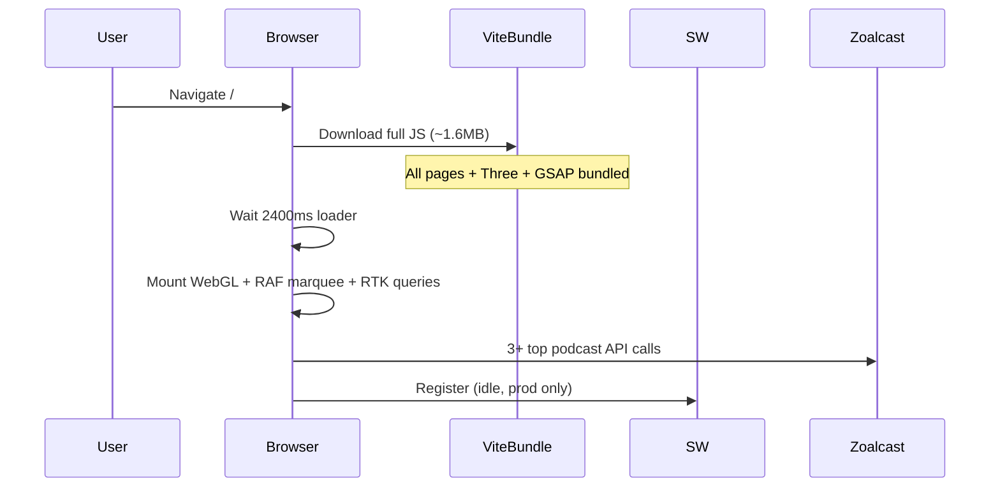
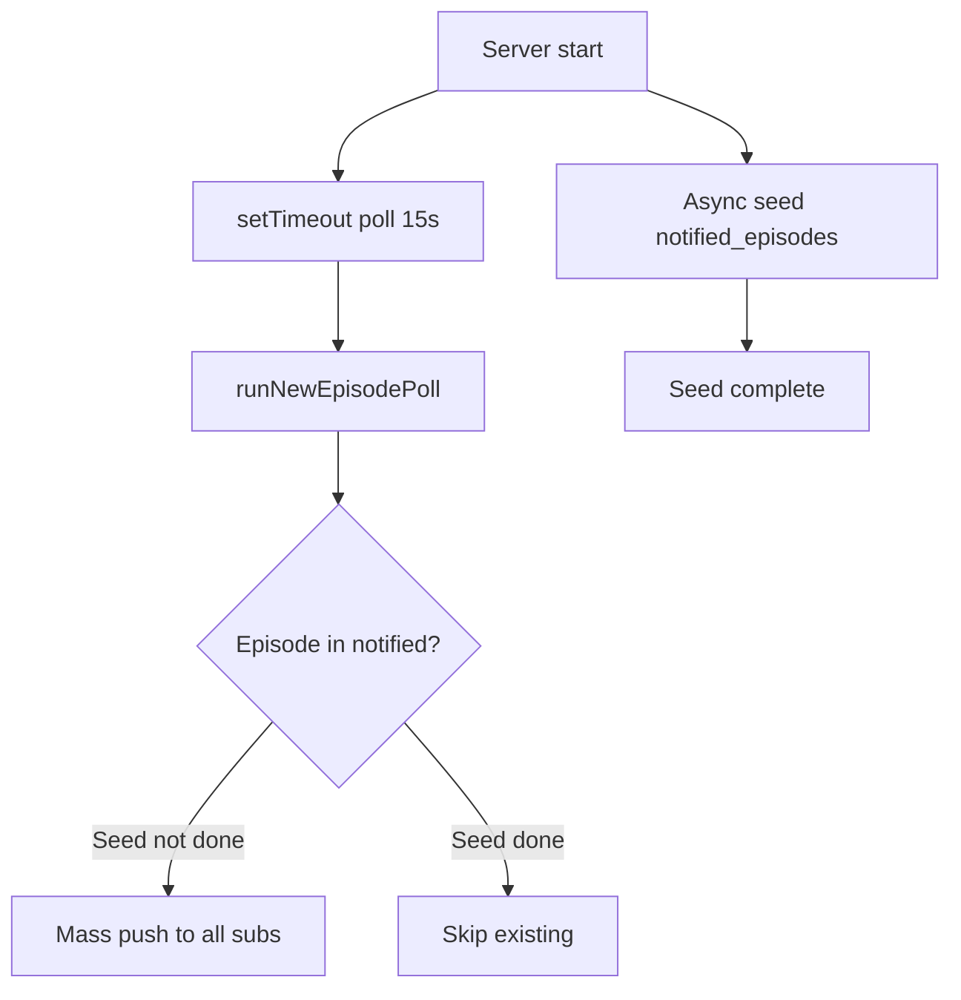

# iSounds Website — Performance & Code Quality Review

**Date:** 2026-06-07  
**Scope:** Frontend (`src/`), Bun server (`server/`), PWA/service worker, data layer, auth, personalization/push pipeline  
**Build context:** Vite 6 + React 19 + RTK Query + SQLite local API + Workbox PWA

---

## Executive summary

The app is feature-rich and structurally sound for a v2 product, but several patterns create **real user-facing performance cost** (large initial bundle, landing LCP delay, continuous re-renders during playback) and **server-side reliability/security risk** (client-spoofable auth, poller seed race, N+1 SQLite in push targeting).

| Category | Critical | High | Medium | Low | **Avg rating** |
|----------|----------|------|--------|-----|----------------|
| Performance | 4 | 6 | 9 | 4 | **7.2 / 10** |
| Security / data | 3 | 4 | 3 | 2 | **8.1 / 10** |
| Maintainability | 0 | 2 | 5 | 4 | **4.8 / 10** |
| UX / Core Web Vitals | 1 | 3 | 2 | 1 | **6.5 / 10** |

**Top 5 fixes by impact:**

1. Lazy-load routes and heavy landing deps (Three.js, GSAP, MagicBento).
2. Throttle player progress Redux updates; narrow selectors in player UI.
3. Remove N+1 `checkLike` POST per card in lists (batch or use list payload).
4. Fix poller seed race before first tick; add in-flight mutex.
5. Replace header-only subscription trust with server-verified auth for local API.

---

## Rating methodology

Each issue is scored **1–10** (higher = more urgent):

| Score | Severity | Meaning |
|-------|----------|---------|
| 9–10 | **Critical** | Security breach, data loss, or severe perf regression affecting most users |
| 7–8 | **High** | Noticeable latency, wasted bandwidth/CPU, or incorrect behavior under load |
| 4–6 | **Medium** | Degrades experience or scales poorly; fix in next sprint |
| 1–3 | **Low** | Cleanup, minor waste, or edge-case |

**Effort:** S (hours), M (1–2 days), L (multi-day refactor)

---

## Issue register (sorted by rating)

| ID | Rating | Severity | Category | Issue | Location | Effort |
|----|--------|----------|----------|-------|----------|--------|
| S-01 | **10** | Critical | Security | Local API trusts `X-ISounds-Msisdn` + `X-ISounds-Subscribed` headers with no server-side carrier/token verification | `server/auth.ts`, all `router.ts` gated routes | L |
| S-02 | **10** | Critical | Security | `GET /api/local/complaints` returns all complaints unauthenticated (PII leak) | `server/router.ts` ~471 | S |
| P-01 | **10** | Critical | Performance | All 15+ pages eagerly imported — no route code splitting despite `lazyRoute()` helper | `src/App.tsx`, `src/lib/lazyRoute.ts` | M |
| P-02 | **9** | Critical | Performance | `timeupdate` dispatches Redux `seek()` ~4–10×/sec → MiniPlayer + EpisodeMediaStage re-render continuously | `src/features/player/GlobalAudio.tsx`, `usePlayer.ts` | M |
| P-03 | **9** | Critical | Performance | Each `EpisodeCard` fires `useCheckLikeQuery` (POST) — 40+ parallel requests on browse for subscribers | `src/components/shared/EpisodeCard.tsx`, `src/store/api.ts` | M |
| P-04 | **9** | Critical | Performance | Dual animation libraries (`framer-motion` + `motion`) in dependencies and imports | `package.json`, multiple components | M |
| S-03 | **9** | Critical | Security | Push subscription `ON CONFLICT(endpoint)` reassigns endpoint to new msisdn (endpoint hijack) | `server/router.ts` ~554 | S |
| S-04 | **9** | Critical | Reliability | Poller seed runs async while first poll fires at 15s — can mass-push all “existing” episodes as new | `server/jobs/newEpisodePoller.ts` ~195–217 | S |
| P-05 | **8** | High | UX / CWV | 2.4s artificial landing loader blocks all content + hero logo animates again after | `src/pages/LandingPage.tsx`, `LandingPageLoader.tsx` | S |
| P-06 | **8** | High | Performance | WebGL Three.js silk shader runs on landing hero (GPU + large deps) | `HeroSilkBackground.tsx`, `Silk.tsx` | M |
| P-07 | **8** | High | Performance | `SubscriptionChecker` depends on inline `onResolved` → can re-run full auth flow on parent re-renders | `src/App.tsx` ~99, `SubscriptionChecker.tsx` ~114 | S |
| P-08 | **8** | High | Performance | `LocalAnalyticsTracker` POSTs visit on every route/search change with no debounce (all users) | `src/features/analytics/LocalAnalyticsTracker.tsx` | S |
| P-09 | **8** | High | Performance | Landing mounts hero + ScrollVelocity RAF + GSAP MagicBento + 3× top-podcast queries at once | `LandingPage.tsx`, landing sections | M |
| P-10 | **8** | High | Performance | RTK default 60s cache + global refetch-on-focus causes burst refetches | `src/store/store.ts`, `src/store/api.ts` | S |
| S-05 | **8** | High | Performance | Poller N+1: `shouldNotifyUser()` = 2 SQLite queries × every push subscriber per episode | `server/jobs/newEpisodePoller.ts` | M |
| S-06 | **8** | High | Performance | Affinity recompute: per-row cache lookups, duplicate visit collection, sequential Zoalcast fetches | `server/affinity.ts` | M |
| S-07 | **8** | High | Performance | SSR shell awaits Zoalcast for OG meta on every SPA path (no timeout/cache) | `server/index.ts`, `server/og.ts` | M |
| S-08 | **8** | High | Performance | SQLite sync I/O on main thread; no WAL / busy_timeout / transactions on multi-row writes | `server/index.ts`, `server/affinity.ts` | M |
| P-11 | **7** | High | Performance | `EpisodeMediaStage` auto `playEpisode()` on mount for audio (loads stream + views without user play) | `src/components/episode/EpisodeMediaStage.tsx` ~69 | S |
| P-12 | **7** | Medium | Performance | `AnimatedOutlet` remounts full route tree on every pathname change | `src/App.tsx` ~54–73 | S |
| P-13 | **7** | Medium | Performance | Perpetual RAF: ScrollVelocity, noise backgrounds, hero card progress — no pause when off-screen | `ScrollVelocity.tsx`, `noise-background.tsx`, `hero-cards.tsx` | M |
| P-14 | **7** | Medium | Performance | Hero carousel mounts all slide images eagerly (no lazy per slide) | `src/components/ui/cards/hero-cards.tsx` | S |
| P-15 | **6** | Medium | Performance | External Unsplash 1200px images on landing categories | `LandingCategoryCard.tsx` | M |
| P-16 | **6** | Medium | Performance | i18n loads all namespaces × both languages synchronously at boot | `src/i18n/index.ts` | S |
| P-17 | **6** | Medium | Performance | `manualChunks` omits `three`, `gsap`, `motion` — heavy deps may sit in main chunk | `vite.config.ts` | S |
| S-09 | **6** | Medium | Security | CORS `Access-Control-Allow-Origin: *` on local API widens browser abuse | `server/router.ts` | S |
| S-10 | **6** | Medium | Reliability | Poller has no in-flight guard — overlapping runs if poll > interval | `newEpisodePoller.ts` | S |
| S-11 | **6** | Medium | Reliability | Episodes with zero push targets still `markNotified` — users never notified later | `newEpisodePoller.ts` ~118 | S |
| S-12 | **6** | Medium | Data | Anonymous listening history shared globally (`msisdn IS NULL`) | `server/router.ts` | M |
| SW-01 | **6** | Medium | PWA | `manifest.json` cached CacheFirst 1yr — stale install metadata after deploy | `src/sw.ts` | S |
| SW-02 | **5** | Medium | PWA | Duplicate image cache buckets; status-0 opaque responses cached | `src/sw.ts` | S |
| M-01 | **5** | Medium | Maintainability | Duplicate affinity recompute on category PATCH (schedule + immediate) | `router.ts`, `affinity.ts` | S |
| M-02 | **5** | Medium | Maintainability | No top-level try/catch in router; unguarded `JSON.parse` on `signals_json` | `server/router.ts`, `affinity.ts` | S |
| M-03 | **5** | Medium | Performance | Missing composite indexes `(msisdn, created_at)` on visits/bookmarks/ratings | `server/migrations.ts` | S |
| P-18 | **4** | Low | Performance | `FullPlayer.tsx` dead code | `src/features/player/FullPlayer.tsx` | S |
| P-19 | **4** | Low | Performance | Three duplicate `useGetTopPodcastsQuery` for topic chip counts | `LandingCategoriesSection.tsx` | S |
| P-20 | **4** | Low | Performance | `checkLike` implemented as POST read — breaks HTTP/RTK caching semantics | `src/store/api.ts` | S |
| S-13 | **4** | Low | Maintainability | Hardcoded portal `6` in sitemap/OG vs env in zoalcast client | `server/sitemap.ts`, `server/og.ts` | S |
| S-14 | **3** | Low | Reliability | Zoalcast fetch errors swallowed silently | `server/zoalcast.ts` | S |
| S-15 | **3** | Low | Security | No rate limiting on public POST endpoints (visits, search-history, pwa-events) | `server/router.ts` | M |

---

## Detailed findings

### 1. Frontend bundle & loading

#### P-01 — No route-level code splitting (Rating: 10)

**Flow:** `main.tsx` → `App.tsx` statically imports every page → Vite bundles landing (Three, GSAP, MagicBento), explore, library, personalization together.

**Evidence:**

```26:43:src/App.tsx
import HomePage from "@/pages/HomePage";
// ... 15+ static page imports
import PersonalizationPage from "@/pages/PersonalizationPage";
```

`lazyRoute()` exists in `src/lib/lazyRoute.ts` but is unused.

**Impact:** First visit downloads ~1.6MB+ JS (per build output). Users hitting `/subscribe` or `/login` still pay for landing WebGL stack.

**Recommendation:** Wrap non-critical routes in `lazyRoute()` + `<Suspense fallback={<PageLoader />}>`.

---

#### P-04 — Dual motion libraries (Rating: 9)

**Dependencies:** Both `framer-motion` and `motion` in `package.json`. Imports split across codebase (`motion/react` vs `framer-motion`).

**Impact:** Two animation runtimes; `manualChunks` only splits `framer-motion`.

**Recommendation:** Standardize on `motion` (already used in App) and migrate remaining `framer-motion` imports.

---

#### P-16 / P-17 — i18n and chunk strategy (Rating: 6)

All 12 locale JSON files import at startup. Vite `manualChunks` lacks `three`, `@react-three/fiber`, `gsap`.

**Recommendation:** Dynamic `import()` per language; add explicit chunks for landing-only deps.

---

### 2. Landing page & Core Web Vitals

#### P-05 — Artificial 2.4s loader (Rating: 8)

**Flow:** `LandingPage` sets `contentReady=false` until `LANDING_LOADER_MS` (2400ms) → hero, text, and images do not mount → LCP delayed.

**Recommendation:** Show hero immediately; use loader only for logo overlay or skip on repeat visits (`sessionStorage`).

---

#### P-06 / P-09 / P-13 — Heavy below-the-fold work on first paint (Rating: 8 / 8 / 7)

After loader, landing synchronously mounts:

- Three.js silk (`HeroSilkBackground`) — continuous GPU frame loop
- `ScrollVelocity` — perpetual `requestAnimationFrame`
- `MagicBento` — GSAP mousemove + particles
- `LandingCategoriesSection` — 3× `useGetTopPodcastsQuery`

None defer until `IntersectionObserver` visible.

**Recommendation:** Lazy-mount sections; pause RAF when `document.hidden` or off-screen.

---

### 3. Player & global state

#### P-02 — Redux progress storm (Rating: 9)

**Flow:** `GlobalAudio` `timeupdate` → `dispatch(seek(currentTime))` → `player.progress` updates → any `useAppSelector(s => s.player)` re-renders.

**Affected UI:** `MiniPlayer`, `EpisodeMediaStage`, progress bars.

**Recommendation:** Throttle to 250–500ms; store progress in ref for high-frequency updates; use `useSelector` with shallow equality on `{ isPlaying, currentEpisode.id }` only.

---

#### P-11 — Auto-play on detail mount (Rating: 7)

**Flow:** Subscribed user opens audio episode → `useEffect` calls `playEpisode(podcast)` → stream loads, views increment without explicit play.

**Recommendation:** Only load episode metadata; start playback on button press.

---

### 4. Data fetching (RTK Query)

#### P-03 — Per-card like checks (Rating: 9)

**Flow:** Browse page → 4 rails × ~10 cards → each subscribed `EpisodeCard` runs `useCheckLikeQuery(id)` which is a **POST** to `/podcast/like`.

**Recommendation:** Use `podcast.liked` from list API; batch endpoint; or fetch likes once per page.

---

#### P-10 — Short cache TTL + refetch-on-focus (Rating: 8)

`setupListeners(store.dispatch)` enables global refocus refetch. Podcast/category endpoints use default 60s `keepUnusedDataFor` except categories (24h).

**Recommendation:** Set `keepUnusedDataFor: 3600` for podcast metadata; disable refetchOnFocus for stable endpoints.

---

### 5. Analytics & personalization client

#### P-08 — Visit tracking on every navigation (Rating: 8)

**Flow:** `LocalAnalyticsTracker` → `recordVisit` on `[pathname, search]` with no debounce for guests or subscribers.

**Recommendation:** Debounce 1–2s; dedupe identical path; optionally batch.

---

#### P-07 — SubscriptionChecker callback instability (Rating: 8)

**Flow:** `AppBootstrap` passes `onResolved={() => setIsBootstrapping(false)}` inline → effect in `SubscriptionChecker` re-runs when parent re-renders → redundant Zoalcast subscription/login calls.

**Recommendation:** `useCallback` in parent or ref-based callback; remove `onResolved` from effect deps.

---

### 6. Server — auth & security

#### S-01 — Client-spoofable identity (Rating: 10)

**Flow:** Browser sets `X-ISounds-Msisdn` and `X-ISounds-Subscribed: 1` via `localApi` → server trusts headers in `getRequestIdentity()`.

Any HTTP client can access bookmarks, ratings, push registration, personalization as any msisdn.

**Recommendation:** Issue signed session token after Zoalcast login; validate on each local API request; re-verify subscription periodically server-side.

---

#### S-02 — Open complaints endpoint (Rating: 10)

`GET /api/local/complaints` has no auth — exposes user phone, msisdn, descriptions.

**Recommendation:** Admin-only auth or remove GET in production.

---

#### S-03 — Push endpoint hijacking (Rating: 9)

Upsert on `endpoint` allows re-binding another user's browser push endpoint to attacker's msisdn.

**Recommendation:** Verify endpoint ownership; only allow same msisdn to update; or store device id.

---

### 7. Server — poller & push pipeline

#### S-04 — Seed race (Rating: 9)

```
startNewEpisodePoller:
  if (!lastPoll) void seedAllExistingAsNotified()  // async, unawaited
  setTimeout(firstPoll, 15_000)
  setInterval(poll, 30min)
```

If seeding takes >15s or fails partially, first poll treats all catalog episodes as new → notification blast.

**Recommendation:** `await seed()` before scheduling first tick; set `poll_state` at start of seed.

---

#### S-05 / S-10 — Poller efficiency (Rating: 8 / 6)

- Loads all `push_subscriptions`, then 2 queries per row in `shouldNotifyUser`
- Sequential `fetchLatestPodcasts(categoryId)` per category
- No mutex if poll duration exceeds 30 min

**Recommendation:** Single SQL JOIN for targets; `Promise.all` category fetches with concurrency cap; `let polling = false` guard.

---

#### S-11 — Premature markNotified (Rating: 6)

Episodes with no eligible subscribers are still inserted into `notified_episodes` — no retry when users later subscribe or enable push.

---

### 8. Server — affinity engine

#### S-06 — N+1 and blocking recompute (Rating: 8)

`computeUserAffinities`:

- Calls `getPodcastCategoryFromCache` per visit/bookmark/rating row
- Sequential `await resolvePodcastCategory()` for unresolved IDs
- Collects visit signals twice
- `/personalization/recompute` blocks HTTP response until complete

**Recommendation:** Bulk-load `podcast_cache WHERE id IN (...)`; parallel resolve with limit; return 202 + background job for recompute.

---

#### M-01 — Double recompute on PATCH (Rating: 5)

`updateCategorySettings` calls `scheduleAffinityRecompute` AND handler calls `void computeUserAffinities()` immediately.

---

### 9. SQLite & infrastructure

#### S-08 — Sync SQLite on event loop (Rating: 8)

Single `bun:sqlite` connection; all queries synchronous in request handlers, poller, and affinity jobs.

Under load: event loop stalls, request latency spikes.

**Recommendation:**

```sql
PRAGMA journal_mode=WAL;
PRAGMA busy_timeout=5000;
```

Wrap multi-row affinity upserts in transactions.

---

#### M-03 — Missing indexes (Rating: 5)

Hot queries filter `WHERE msisdn = ? AND created_at >= ?` but only `idx_visits_msisdn` exists.

**Recommendation:** Add `(msisdn, created_at)` on visits, `(msisdn, updated_at)` on listening_history.

---

### 10. PWA / service worker

#### SW-01 — Stale manifest (Rating: 6)

`src/sw.ts` matches `*.json` with CacheFirst + 1-year TTL — includes `/manifest.json`.

After deploy, installed PWA may keep old manifest until cache expires.

**Recommendation:** `NetworkFirst` for `manifest.json`; keep CacheFirst for hashed `/assets/*`.

---

#### SW-02 — Cache policy overlap (Rating: 5)

Same-origin images match static route; cross-origin match separate route — dual buckets. Status `0` (opaque) responses cached.

API correctly uses `NetworkOnly` for `/api/local` and Zoalcast (recent change).

---

### 11. SSR / SEO shell

#### S-07 — Blocking OG meta fetch (Rating: 8)

Non-file routes inject meta by fetching Zoalcast per podcast/category. Category pages fetch entire category list to resolve one name.

**Impact:** TTFB tied to third-party API; no timeout.

**Recommendation:** In-memory cache (5–15 min TTL); hard timeout (2s); static fallbacks.

---

## Flow diagrams

### Current first-load path (landing `/`)



### Playback progress re-render loop

```mermaid
flowchart LR
  Audio[audio timeupdate 4-10 Hz] --> Dispatch[dispatch seek]
  Dispatch --> Redux[player.progress]
  Redux --> MiniPlayer
  Redux --> EpisodeMediaStage
  Redux --> Any usePlayer subscriber
```

### Poller first-run risk



---

## Recommended remediation roadmap

### Phase 1 — Quick wins (1–3 days)

| Priority | Issue IDs | Action |
|----------|-----------|--------|
| 1 | S-04, S-10 | Await poller seed; add in-flight mutex |
| 2 | P-07 | Stabilize `SubscriptionChecker` callback |
| 3 | P-05 | Reduce/remove forced landing loader delay |
| 4 | P-08 | Debounce visit analytics |
| 5 | S-02 | Protect or remove `GET /complaints` |
| 6 | SW-01 | NetworkFirst for manifest.json |

### Phase 2 — Performance (1 week)

| Priority | Issue IDs | Action |
|----------|-----------|--------|
| 1 | P-01, P-17 | Route lazy loading + chunk three/gsap |
| 2 | P-02, P-11 | Throttle player Redux; no auto-play |
| 3 | P-03 | Batch like status |
| 4 | P-04 | Consolidate motion library |
| 5 | P-10 | Tune RTK cache / refetchOnFocus |

### Phase 3 — Server hardening (1–2 weeks)

| Priority | Issue IDs | Action |
|----------|-----------|--------|
| 1 | S-01, S-03 | Signed sessions; fix push upsert |
| 2 | S-05, S-06 | SQL JOIN targeting; bulk affinity |
| 3 | S-08, M-03 | WAL, indexes, transactions |
| 4 | S-07 | OG meta cache + timeout |

### Phase 4 — Landing optimization (ongoing)

| Priority | Issue IDs | Action |
|----------|-----------|--------|
| 1 | P-06, P-09, P-13 | Intersection-based section mount; pause RAF |
| 2 | P-14, P-15 | Lazy hero slides; self-host category thumbs |

---

## What is working well

- **API vs static separation in SW** — local/Zoalcast API uses `NetworkOnly`; UI assets CacheFirst (recent `src/sw.ts`).
- **Subscriber route gating** — `RequireSubscribed` pattern for library/personalization is clear.
- **RTK Query deduplication** — identical `getTopPodcasts` args share one request (helps HomePage duplicate rails).
- **Reduced motion** — respected in several animation components (`useReducedMotion`).
- **Affinity design** — transparent weighted scoring (no opaque ML); debounced recompute queue is the right idea.
- **Episode card memoization** — `EpisodeCard` wrapped in `memo()` (undermined by per-instance hooks but intent is good).

---

## Appendix — files reviewed

| Area | Key paths |
|------|-----------|
| Entry & routing | `src/main.tsx`, `src/App.tsx`, `src/lib/lazyRoute.ts` |
| State & API | `src/store/store.ts`, `src/store/api.ts`, `src/store/localApi.ts` |
| Player | `src/features/player/GlobalAudio.tsx`, `playerSlice.ts`, `MiniPlayer.tsx`, `EpisodeMediaStage.tsx` |
| Landing | `src/pages/LandingPage.tsx`, `LandingHeroSection.tsx`, `ScrollVelocity.tsx`, `MagicBento.tsx` |
| Analytics | `src/features/analytics/LocalAnalyticsTracker.tsx`, `server/affinity.ts` |
| Auth | `src/features/auth/SubscriptionChecker.tsx`, `server/auth.ts` |
| Server | `server/router.ts`, `server/index.ts`, `server/migrations.ts`, `server/jobs/newEpisodePoller.ts` |
| PWA | `src/sw.ts`, `vite.config.ts`, `src/registerPwa.ts` |

---

*Report generated from static code review and architecture analysis. Validate critical items with production profiling (Lighthouse, React DevTools Profiler, Bun/SQLite query logs) before and after fixes.*
